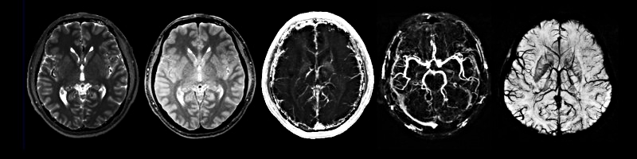

### Hi there, I'm Abbas Mazrouei Sebdani

- 🦾 I'm a Software (Biomedical AI) developer
-----------------------------------
- 💻 I’m currently working on High-Tech products, Including:
MRI, Radiography, CT scan and TPS (radiotherapy machines)
------------------------------------------------------------
- 🤖 I enjoy daily learning of topics such as:
Image & Signal processing, Computer Vision, Machine Learning & Deep Learning (AI)

-
 

 

 

 
---

 

   

 
---

You can reach me at 
.
